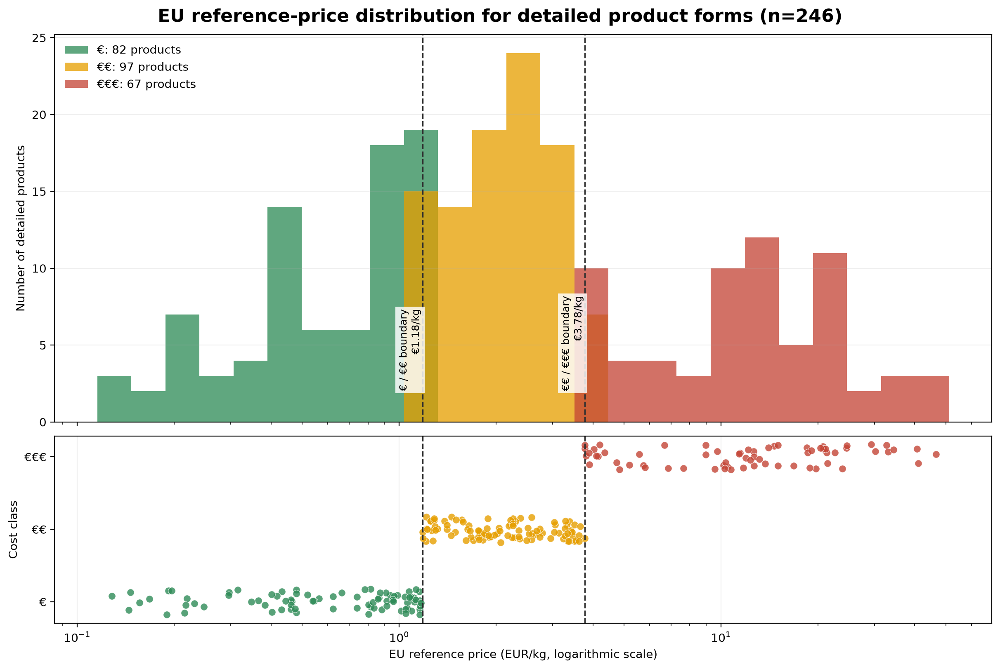
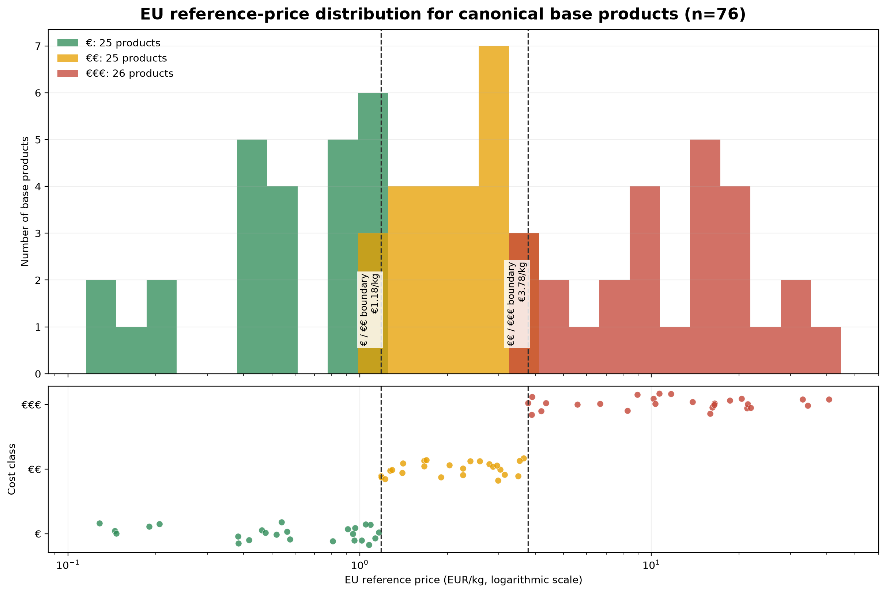
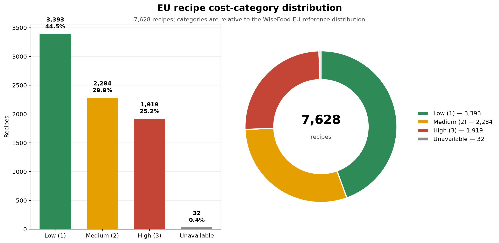

# Recipe cost workflow

This document describes the current WiseFood cost pipeline. It creates
auditable **economic reference prices** for ingredients and uses them to assign
recipes a relative cost category. It is not a supermarket-shopping basket or a
claim that a recipe costs an exact amount in a particular shop.

## Sources

The raw downloads are retained under [`data/cost/raw/`](../data/cost/raw/); the
pipeline writes reproducible outputs under
[`data/cost/processed/`](../data/cost/processed/). Those files are then
imported into PostgreSQL, which is the runtime authority for price lookup.

| Source | Role in the pipeline |
| --- | --- |
| [European Commission Agri-food Data Portal](https://agridata.ec.europa.eu/extensions/DataPortal/prices.html) | Agricultural commodity and market-price series for meat, poultry, dairy, eggs, cereals, fruit and vegetables, oils, rice, sugar, and related products. |
| [Eurostat `prc_ppp_ind_1` — Price Level Indices](https://ec.europa.eu/eurostat/databrowser/view/prc_ppp_ind_1/default/table?lang=en&category=prc.prc_ppp) | Food-category price-level indices used to express source-country observations as equivalent estimates for Ireland, Hungary, Slovenia, and the EU reference. The pipeline uses the 2025 `EU27_2020=100` PLI rows, not PPP values. |
| [EUMOFA dashboards](https://fishery-aquaculture-market-observatory.ec.europa.eu/en/data/dashboards) | Monthly median online-retail prices for fish and seafood. Fresh, frozen, smoked, and prepared forms remain distinct source-derived products. |

The current source-price window is **2025-08-01 to 2026-07-31**. The raw EC
series include different market stages, so the correct description is
“economic reference price” rather than “supermarket price.” EUMOFA fish rows
are explicitly retail online-price observations.

## From raw observations to a regional product price

1. Raw observations are normalized to a canonical product, detailed form,
   country, date, market stage, food group, and EUR/kg. Non-food/feed rows,
   impossible units, live-animal prices, and stale fish series are rejected.
2. Within each country, stage, product, and date, duplicate market observations
   are collapsed to a median. A representative price is then calculated for the
   current complete-month window.
3. Each source-country price is projected to every target region with the
   matching Eurostat food-category PLI:

   ```text
   target EUR/kg = source EUR/kg × target-region PLI / source-region PLI
   ```

4. For **EU**, **IE**, **HU**, and **SI** separately, the projected
   source-country values are combined with an equal-country median. This means
   a country with many observations cannot dominate the result. Where a direct
   target-country observation exists, it participates alongside the converted
   evidence.
5. A documented downstream-stage priority selects one economic proxy per
   detailed product and region. The pipeline never averages different market
   stages together.
6. Each canonical base class is the median of its selected detailed-product
   prices in that same region. For example, the general regional price for
   `chicken` is the median of the available selected chicken forms; it is not a
   separate mean invented from recipe text.

The resulting catalogue contains four prices for every supported product:
`EU`, `IE`, `HU`, and `SI`. `EU` is the common reference; `IE`, `HU`, and `SI`
are region-specific estimates produced by the same method.

At runtime, PostgreSQL stores this catalogue in three tables:

- `cost_products`: canonical base and detailed products plus provenance;
- `cost_prices`: one EUR/kg row per product and region;
- `cost_aliases`: reviewed normalized ingredient phrases linked to a product.
- `cost_recipe_calibrations`: the active Q33/Q67 recipe-category thresholds for
  each region, with older rows retained for audit.

Neo4j stores the semantic Ingredient/FoodOn-to-cost-product links. Elasticsearch
stores only the final per-recipe facets; it is not the ingredient-price source.

## Two catalogue levels

The catalogue intentionally preserves both the source detail and the general
class used most often by recipes.

- **Detailed, source-derived products (246):** for example `salmon — fresh,
  fillets` or a particular EUMOFA fish preparation. A detailed price is used
  when it is explicitly supported.
- **Canonical base products (76):** for example `chicken`, `beef`, `tomato`,
  and `milk`. These are regional medians of their selected detailed forms and
  provide robust general values when a recipe says `chicken breast`, `chicken
  wings`, or another unpriced chicken form.





The `€`, `€€`, and `€€€` labels are relative ingredient price classes, not
literal one-, two-, or three-euro prices. They are fixed from the EU
distribution of the 76 base products: `€` below €1.18/kg, `€€` from €1.18/kg
to below €3.78/kg, and `€€€` from €3.78/kg upward. Detailed products inherit
these same fixed boundaries, which makes detailed and base values comparable.

## Matching a recipe ingredient to cost evidence

For each ingredient, the cost resolver tries the safest available link in this
order:

```text
exact supported detailed product
        → exact canonical base product
        → reviewed alias / approved graph cost reference
        → approved FoodOn economic group
        → no price match
```

Examples:

- `chicken breast` or `chicken wings` can use the canonical `chicken` base
  reference.
- `beef roast` can use `beef` when no supported detailed beef form exists.
- An ingredient linked unambiguously to a FoodOn vegetable group can use the
  median of the **canonical vegetable base products** only as a last fallback.

The broad FoodOn fallback is deliberately blocked for unsafe processed contexts
such as stock, broth, sauce, juice, paste, powder, vinegar, or flour. Those
phrases are not economically equivalent to the food word they contain.

## Recipe calculation and category

For a chosen region, every matched positive-weight ingredient contributes:

```text
ingredient contribution = ingredient weight (kg) × matched regional EUR/kg
```

The contributions are summed and divided by servings. This internal value is
used only to rank recipes; it is not published as an exact recipe price.

Each region has its own frozen reference distribution, calculated from the
same sufficiently covered recipe corpus using that region's price column. A
recipe is then labelled within its selected region:

- `low` / `1`: at or below that region's 33rd percentile;
- `medium` / `2`: above the 33rd through the 67th percentile;
- `high` / `3`: above that region's 67th percentile.

The Elasticsearch field is a nested `cost` array, with one object for each of
`EU`, `IE`, `HU`, and `SI`. This makes it possible to filter a category and its
coverage within the same region without mixing fields from different regions.
Each regional object gives the evidence needed to interpret the result:

- `priced_weight_coverage`: matched positive ingredient weight divided by all positive
  ingredient weight;
- `priced_ingredient_coverage`: number of costed ingredient rows divided by all
  ingredient rows;
- `contributors`: every ingredient with a positive matched contribution, with
  the displayed ingredient, matched product/group, scope, relative price
  class, and share of matched cost;

Ingredients without a safe price link or usable positive weight do not invent a
cost. A recipe with no priced contributor is `unavailable`.



The public facet is stored as the top-level `cost` array in Elasticsearch; the
complete internal numeric audit remains in the recipe profile store.

## Reproduce

```bash
uv run python -m recipe_wrangler.pricing.pipeline
uv run alembic upgrade head
uv run python scripts/pricing/import_cost_catalogue_to_postgres.py
uv run python scripts/one_off/backfill_recipe_cost_categories.py --apply
uv run python scripts/pricing/generate_base_price_distribution_plot.py
```

The key generated artefacts are
[`ingredient_prices_classified.csv`](../data/cost/processed/ingredient_prices_classified.csv),
[`cost_classification_metadata.json`](../data/cost/processed/cost_classification_metadata.json),
and the EU recipe facets under
[`recipe_cost_categories/`](../data/cost/processed/recipe_cost_categories/).
